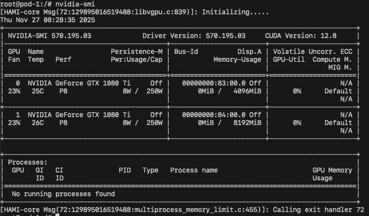

# HAMi DRA Driver

## Overview

DRA is a Kubernetes feature that lets you request and share resources among Pods, it provides a flexible way for requesting, configuring, and sharing specialized devices like GPUs. To learn more about DRA in general, good starting points are: [Kubernetes docs](https://kubernetes.io/docs/concepts/scheduling-eviction/dynamic-resource-allocation/), [Kubernetes blog](https://kubernetes.io/blog/2025/05/01/kubernetes-v1-33-dra-updates/).

The HAMi DRA Driver brings the support of DRA for [HAMi-Core](https://github.com/Project-HAMi/HAMi-core)(the in-container GPU resource controller), it might be the first open source DRA Driver for NVIDIA GPU with [DRA Consumable Capacity](https://github.com/kubernetes/enhancements/tree/master/keps/sig-scheduling/5075-dra-consumable-capacity) feature enabled.

## Installation

### Prerequisites

The list of prerequisites for running the DRA Driver for HAMi-Core is described below
- NVIDIA drivers >= 440
- nvidia-docker version > 2.0
- default runtime configured as nvidia for containerd/docker/cri-o container runtime
- Kubernetes version >= 1.34 with DRA Consumable Capacity feature enabled
- glibc >= 2.17 & glibc < 2.30
- kernel version >= 3.10


Please check the [DaemonSet configuration](demo/yaml/ds.yaml) in the demo/yaml directory. We are working on a Helm Chart for this DRA Driver, it will be available in the near future.

## Demo

```yaml
apiVersion: resource.k8s.io/v1
kind: ResourceClaim
...
spec:
  devices:
    requests:
    - name: double-gpu-0-0
      exactly:
        ...
        capacity:
          requests:
            cores: 30
            memory: "4Gi"
    - name: double-gpu-0-1
      exactly:
        ...
        capacity:
          requests:
            cores: 60
            memory: "8Gi"
```


Please refer to the [demo.md](demo/demo.md) for more information.

## Contributing

Contributions require a Developer Certificate of Origin (DCO, see [CONTRIBUTING.md](https://github.com/Project-HAMi/HAMi/blob/master/CONTRIBUTING.md).

## Support

Please open an issue on the GitHub project for questions and for reporting problems.
Your feedback is appreciated!
